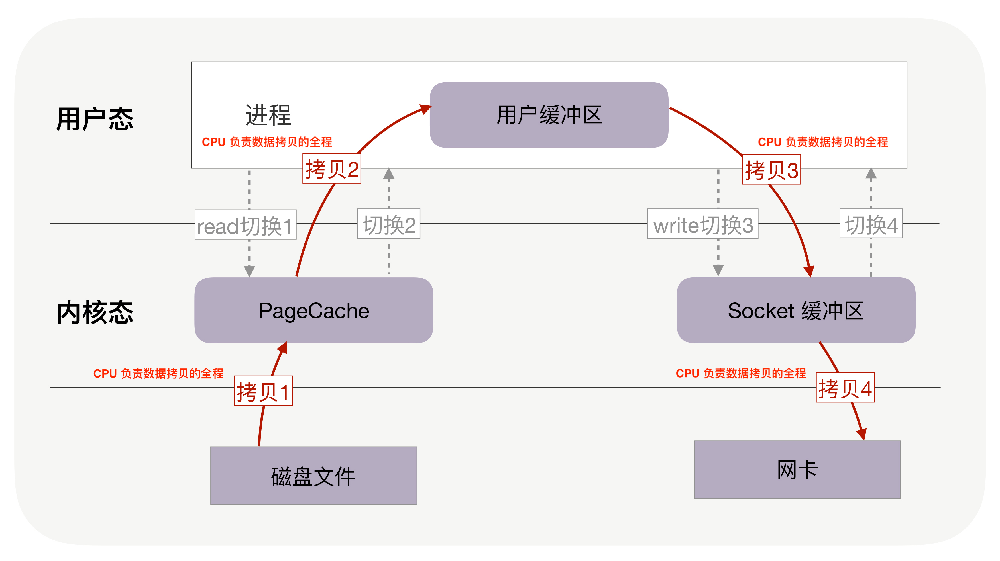
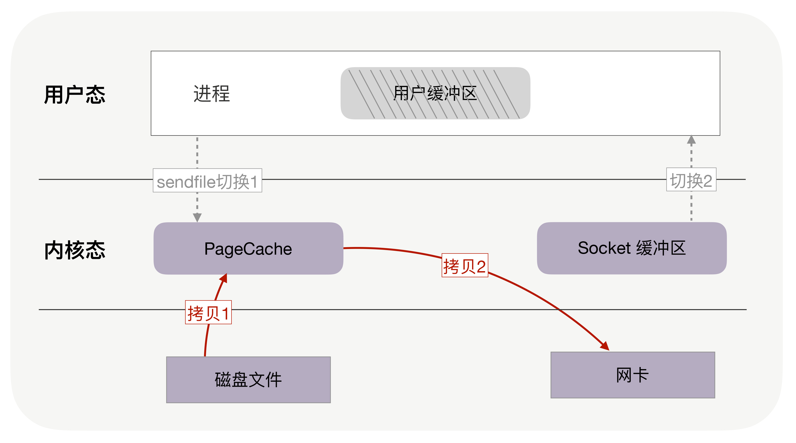

# DMA 与零拷贝技术

> **注意事项**：除了 Direct I/O，与磁盘相关的文件读写操作都有使用到 page cache 技术。 

## 1. 数据的四次拷贝与四次上下文切换

很多应用程序在面临客户端请求时，可以等价为进行如下的系统调用：

1. File.read(file, buf, len);
2. Socket.send(socket, buf, len);

例如消息中间件 Kafka 就是这个应用场景，从磁盘中读取一批消息后原封不动地写入网卡（NIC，Network interface controller）进行发送。

在没有任何优化技术使用的背景下，操作系统为此会进行 4 次数据拷贝，以及 4 次上下文切换，如下图所示：

如果没有优化，读取磁盘数据，再通过网卡传输的场景性能比较差：

4 次 copy：

1. CPU 负责将数据从磁盘搬运到内核空间的 Page Cache 中；
2. CPU 负责将数据从内核空间的 Socket 缓冲区搬运到的网络中；
3. CPU 负责将数据从内核空间的 Page Cache 搬运到用户空间的缓冲区；
4. CPU 负责将数据从用户空间的缓冲区搬运到内核空间的 Socket 缓冲区中；

4 次上下文切换：

1. read 系统调用时：用户态切换到内核态；
2. read 系统调用完毕：内核态切换回用户态；
3. write 系统调用时：用户态切换到内核态；
4. write 系统调用完毕：内核态切换回用户态；

我们不免发出抱怨：

1. CPU 全程负责内存内的数据拷贝还可以接受，因为效率还算，但是如果要全程负责内存与磁盘、网络的数据拷贝，这将难以接受，因为磁盘、网卡的速度远小于内存，内存远远小于 CPU；
2. 4 次 copy 太多了，4 次上下文切换也太频繁了；

## 2. DMA 参与下的数据四次拷贝

DMA 技术很容易理解，本质上，DMA 技术就是我们在主板上放一块独立的芯片。在进行内存和 I/O 设备的数据传输的时候，我们不再通过 CPU 来控制数据传输，而直接通过 DMA 控制器（DMA Controller，简称 DMAC）。这块芯片，我们可以认为它其实就是一个协处理器（Co-Processor）。

DMAC 最有价值的地方体现在，当我们要传输的数据特别大、速度特别快，或者传输的数据特别小、速度特别慢的时候。

比如说，我们用千兆网卡或者硬盘传输大量数据的时候，如果都用 CPU 来搬运的话，肯定忙不过来，所以可以选择 DMAC。而当数据传输很慢的时候，DMAC 可以等数据到齐了，再发送信号，给到 CPU 去处理，而不是让 CPU 在那里忙等待。

注意，这里面的“协”字。DMAC 是在“协助”CPU，完成对应的数据传输工作。在 DMAC 控制数据传输的过程中，我们还是需要 CPU 的进行控制，但是具体数据的拷贝不再由 CPU 来完成。

原本，计算机所有组件之间的数据拷贝（流动）必须经过 CPU，如下图所示：

现在，DMA 代替了 CPU 负责内存与磁盘以及内存与网卡之间的数据搬运，CPU 作为 DMA 的控制者，如下图所示：

但是 DMA 有其局限性，DMA 仅仅能用于设备之间交换数据时进行数据拷贝，但是设备内部的数据拷贝还需要 CPU 进行，例如 CPU 需要负责内核空间数据与用户空间数据之间的拷贝（内存内部的拷贝），如下图所示：

上图中的 read buffer 也就是 page cache，socket buffer 也就是 Socket 缓冲区。

## 3. 零拷贝技术

### 3.1 什么是零拷贝技术？

零拷贝技术是一个思想\[3]，指的是指计算机执行操作时，CPU 不需要先将数据从某处内存复制到另一个特定区域。

可见，零拷贝的特点是 CPU 不全程负责内存中的数据写入其他组件，CPU 仅仅起到管理的作用。但注意，零拷贝不是不拷贝，如果数据源不在内存，那么必须要拷贝，因为数据只有在内存中，才能被转移，才能被 CPU 直接读取计算。

零拷贝技术的具体实现方式有很多，例如：

- sendfile
- mmap
- splice
- 直接 Direct I/O

不同的零拷贝技术适用于不同的应用场景，下面依次进行分析。

下面依次介绍上述技术。

### 3.2 sendfile

snedfile 的应用场景是：用户从磁盘读取一些文件数据后不需要经过任何计算与处理就通过网络传输出去。此场景的典型应用是消息队列。

在传统 I/O 下，正如第一节所示，上述应用场景的一次数据传输需要四次 CPU 全权负责的拷贝与四次上下文切换。

下面以逐步设计 sendfile 的思路来讲解基于 sendfile 的零拷贝技术。

**1.利用 DMA 技术**

sendfile 依赖于 DMA 技术，将四次 CPU 全权负责的拷贝与四次上下文切换减少到两次，如下图所示：

> 利用 DMA 技术减少 2 次 CPU 全程参与的拷贝

DMA 负责磁盘到内核空间中的 Page cache（read buffer）的数据拷贝以及从内核空间中的 socket buffer 到网卡的数据拷贝。

**2.传递文件描述符代替数据拷贝**

传递文件描述可以代替数据拷贝，这是由于两个原因：

- page cache 以及 socket buffer 都在内核空间中；
- 数据传输过程前后没有任何写操作；

> 利用传递文件描述符代替内核中的数据拷贝

注意事项：只有网卡支持 SG-DMA（The Scatter-Gather Direct Memory Access）技术才可以通过传递文件描述符的方式避免内核空间内的一次 CPU 拷贝。这意味着此优化取决于 Linux 系统的物理网卡是否支持（Linux 在内核 2.4 版本里引入了 DMA 的 scatter/gather -- 分散/收集功能，只要确保 Linux 版本高于 2.4 即可）。

**3.一次系统调用代替两次系统调用**

由于 sendfile 仅仅对应一次系统调用，而传统文件操作则需要使用 read 以及 write 两个系统调用。

正因为如此，sendfile 能够将用户态与内核态之间的上下文切换从 4 次讲到 2 次。

> sendfile 系统调用仅仅需要两次上下文切换

另一方面，我们需要注意 sendfile 系统调用的局限性。如果应用程序需要对从磁盘读取的数据进行写操作，例如解密或加密，那么 sendfile 系统调用就完全没法用。这是因为用户线程根本就不能够通过 sendfile 系统调用得到传输的数据。

### 3.3 mmap

mmap 技术在[4] 中单独展开，这里就不再详细描述。

### 3.4 Direct I/O 

Direct I/O 即直接 I/O。其名字中的"直接"二字用于区分使用 page cache 机制的缓存 I/O。

- 缓存文件 I/O：用户空间要读写一个文件并不直接与磁盘交互，而是在 page cache 上进行读写操作；
- 直接文件 I/O：用户空间读取的文件直接与磁盘交互，没有中间 page cache 层；

"直接"在这里还有另一层语义：其他所有技术中，数据至少需要在内核空间存储一份，但是在 Direct I/O 技术中，数据直接存储在用户空间中，绕过了内核。

Direct I/O 模式如下图所示：

> Direct I/O 示意图

此时用户空间直接通过 DMA 的方式与磁盘以及网卡进行数据拷贝。

**Direct I/O 的读写非常有特点**：

- Write 操作：由于其不使用 page cache，所以其进行写文件，如果返回成功，数据就真的落盘了（不考虑磁盘自带的缓存）；
- Read 操作：由于其不使用 page cache，每次读操作是真的从磁盘中读取，不会从文件系统的缓存中读取。

**事实上，即使 Direct I/O 还是需要使用操作系统的 fsync 系统调用。为什么？**

这是因为虽然文件的数据本身没有使用任何缓存，但是文件的元数据仍然需要缓存，包括 VFS 中的 inode cache 和 dentry cache 等。

如果你要求元数据在每次修改时也进行落盘，那么即使在 Direct I/O 模式下，也不得不在每次 write 操作下都进行 flush 调用，如果可以接受服务器宕机时文件元数据的丢失，那么可以选择不调用 flush。MySQL 的 O_DIRECT 与 O_DIRECT_NO_FSYNC 配置是一个具体案例[]。

Direct I/O 的优缺点：

**（1）优点**

1. Linux 中的直接 I/O 技术省略掉缓存 I/O 技术中操作系统内核缓冲区的使用，数据直接在应用程序地址空间和磁盘之间进行传输，从而使得自缓存应用程序可以省略掉复杂的系统级别的缓存结构，而执行程序自己定义的数据读写管理，从而**降低系统级别的管理对应用程序访问数据的影响**。
2. 与其他零拷贝技术一样，避免了内核空间到用户空间的数据拷贝，如果要传输的数据量很大，使用直接 I/O 的方式进行数据传输，而不需要操作系统内核地址空间拷贝数据操作的参与，这将会大大提高性能。

**（2）缺点**

1. 由于设备之间的数据传输是通过 DMA 完成的，因此**用户空间的数据缓冲区内存页必须进行 page pinning（页锁定）**，这是为了防止其物理页框地址被交换到磁盘或者被移动到新的地址而导致 DMA 去拷贝数据的时候在指定的地址找不到内存页从而引发缺页错误，而页锁定的开销并不比 CPU 拷贝小，所以为了避免频繁的页锁定系统调用，应用程序必须分配和注册一个持久的内存池，用于数据缓冲。
2. 如果访问的数据不在应用程序缓存中，那么每次数据都会直接从磁盘进行加载，这种直接加载会非常缓慢。
3. 在应用层引入直接 I/O 需要应用层自己管理，这带来了额外的系统复杂性；

**谁会使用 Direct I/O？**

IBM[5]的一篇文章指出，自缓存应用程序（ self-caching applications）可以选择使用 Direct I/O。

> 自缓存应用程序
>
> 对于某些应用程序来说，它会有它自己的数据缓存机制，比如，它会将数据缓存在应用程序地址空间，这类应用程序完全不需要使用操作系统内核中的高速缓冲存储器，这类应用程序就被称作是自缓存应用程序（ self-caching applications ）。
>
> 例如，应用内部维护一个缓存空间，当有读操作时，首先读取应用层的缓存数据，如果没有，那么就通过 Direct I/O 直接通过磁盘 I/O 来读取数据。缓存仍然在应用，只不过应用觉得自己实现一个缓存比操作系统的缓存更高效。
>
> **数据库管理系统是这类应用程序的一个代表**。自缓存应用程序倾向于使用数据的逻辑表达方式，而非物理表达方式；当系统内存较低的时候，自缓存应用程序会让这种数据的逻辑缓存被换出，而并非是磁盘上实际的数据被换出。自缓存应用程序对要操作的数据的语义了如指掌，所以它可以采用更加高效的缓存替换算法。自缓存应用程序有可能会在多台主机之间共享一块内存，那么自缓存应用程序就需要提供一种能够有效地将用户地址空间的缓存数据置为无效的机制，从而确保应用程序地址空间缓存数据的一致性。

另一方面，目前 Linux 上的异步 IO 库，需要文件使用 O_DIRECT 模式打开，它们通常一起配合使用。

## 4. 典型案例

### 4.1 Kakfa

Kafka 作为一个消息队列，涉及到磁盘 I/O 主要有两个操作：

- Provider 向 Kakfa 发送消息，Kakfa 负责将消息以日志的方式持久化落盘；
- Consumer 向 Kakfa 进行拉取消息，Kafka 负责从磁盘中读取一批消息，然后再通过网卡发送；

Kakfa 服务端接收 Provider 的消息并持久化的场景下使用 mmap 机制[6]，能够基于顺序磁盘 I/O 提供高效的持久化能力，使用的 Java 类为 java.nio.MappedByteBuffer。

Kakfa 服务端向 Consumer 发送消息的场景下使用 sendfile 机制[7]，这种机制主要两个好处：

- sendfile 避免了内核空间到用户空间的 CPU 参与数据移动；
- sendfile 基于 Page Cache 实现，因此如果有多个 Consumer 在同时消费一个主题的消息，那么由于消息一直在 page cache 中进行了缓存，因此只需一次磁盘 I/O，就可以服务于多个 Consumer；

### 4.2 MySQL

MySQL 的具体实现比 Kakfa 复杂很多，这是因为支持 SQL 查询的数据库本身比消息队列对复杂很多。

MySQL 的零拷贝技术使用方式请异步另一篇文章[8]。

## 5. 总结

DMA 技术的推出使得内存与其他组件，例如磁盘、网卡进行数据拷贝时，CPU 仅仅需要发出控制信号，而拷贝数据的过程则由 DMA 负责完成。

Linux 的零拷贝技术有多种实现策略，但根据策略可以分为如下几种类型：

- **减少甚至避免用户空间和内核空间之间的数据拷贝**：在一些场景下，用户进程在数据传输过程中并不需要对数据进行访问和处理，那么数据在 Linux 的 `Page Cache` 和用户进程的缓冲区之间的传输就完全可以避免，让数据拷贝完全在内核里进行，甚至可以通过更巧妙的方式避免在内核里的数据拷贝。这一类实现一般是是通过增加新的系统调用来完成的，比如 Linux 中的 mmap()，sendfile() 以及 splice() 等。
- **绕过内核的直接 I/O**：允许在用户态进程绕过内核直接和硬件进行数据传输，内核在传输过程中只负责一些管理和辅助的工作。这种方式其实和第一种有点类似，也是试图避免用户空间和内核空间之间的数据传输，只是第一种方式是把数据传输过程放在内核态完成，而这种方式则是直接绕过内核和硬件通信，效果类似但原理完全不同。
- **内核缓冲区和用户缓冲区之间的传输优化**：这种方式侧重于在用户进程的缓冲区和操作系统的页缓存之间的 CPU 拷贝的优化。这种方法延续了以往那种传统的通信方式，但更灵活。

# REFERENCE

- \[1][CPU：一个故事看懂DMA](https://zhuanlan.zhihu.com/p/272200286)
- \[2][Linux I/O 原理和 Zero-copy 技术全面揭秘](https://zhuanlan.zhihu.com/p/308054212)
- \[3][零复制 - 维基百科，自由的百科全书](https://zh.wikipedia.org/wiki/%E9%9B%B6%E5%A4%8D%E5%88%B6)
- \[4][mmap](https://spongecaptain.cool/SimpleClearFileIO/3. mmap.html)
- \[5][直接 I/O 的动机](https://www.ibm.com/developerworks/cn/linux/l-cn-directio/)
- \[6][kafka.log.AbstractIndex](https://github.com/apache/kafka/blob/trunk/core/src/main/scala/kafka/log/AbstractIndex.scala)
- \[7][Apache Kafka DOCUMENTATION](https://kafka.apache.org/08/documentation.html)
- \[8][MySQL 的零拷贝技术](https://spongecaptain.cool/zerocopyofmysql)

