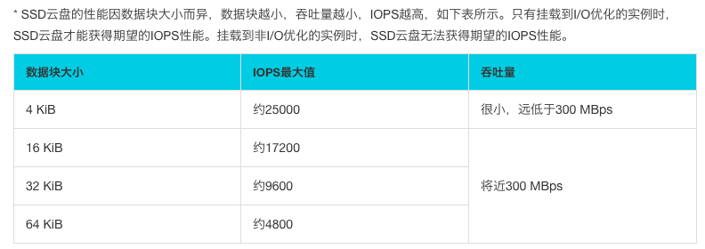

# FileChannel 学习

## 1. FileChannel 的用途

JDK 提供三种文件 I/O 方式，如下：

1. **普通 I/O**：存在于 java.io 包中的 FileWriter 与 FileReader 类；
2. **FileChannel（文件通道）**：存在于 java.nio 包中的 FileChannel 类；
3. **MMAP（内存映射）**：此方法较为特殊，由 FileChannel#map 方法衍生出的一种特殊的读写文件方式；

## 2. FileChannel 优势

FileChannel 被 JavaDocs 称呼为：A channel for reading, writing, mapping, and manipulating a file，即 FileChannel 是用于读、写、映射、维护一个文件的通道。

> 本节有参考：
>
> - [Guide to Java FileChannel](https://www.baeldung.com/java-filechannel)

FileChannel 的优势如下：

- 可以在文件的特定位置进行读写操作；
- 可以直接将文件的一部分加载到内存中；
- 可以以更快的速度从一个通道传输文件数据到另一个通道；
- 可以锁定文件的一部分，以限制其他线程访问；
- 为了避免数据丢失，我们可以强制将对文件的写入更新立即写入存储；

总结起来有：

| FileInputStream/FileOutputStream |      FileChannel       |
| -------------------------------- | :--------------------: |
| 单向                             |          双向          |
| 面向字节的读写                   |    面向 Buffer 读写    |
| 不支持                           |    支持内存文件映射    |
| 不支持                           | 支持转入或转出其他通道 |
| 不支持                           |       支持文件锁       |
| 不支持操作文件元信息             |  不支持操作文件元信息  |

**注意**：虽然 FileChannel 类位于 java.nio 包下，FileChannel 只能运行在阻塞（blocking）模式下，而无法运行在非阻塞非模式（non-blocking）下。

## 3. FileChannel 的 API

> 本节参考于：https://www.cnblogs.com/lxyit/p/9170741.html

FileChannel 类提供的重要 API 如下表所示：

| 方法                       |                 描述                  |
| -------------------------- | :-----------------------------------: |
| open                       |           创建 FileChannel            |
| read/write                 |         基于 FileChannel 读写         |
| force                      | 强制将 FileChannel 中的数据刷入文件中 |
| map                        |             内存文件映射              |
| transferTo 和 transferFrom |            转入与转出通道             |
| lock/tryLock               |              获取文件锁               |

### 3.1 得到一个 FileChannel 实例

创建 FileChannel 实例的方式一共有三个：

1. FileChanel#open 方法；
2. RandomAccessFile#getChannel 方法；
3. RandomAccessFile#getChannel 方法；

还可以设置文件的操作模式（OpenOption 操作符控制）：

- **READ**：只读方式；
- **WRITE**：只写方式；
- **APPEND**：只追加方式；
- **CREATE**：创建新文件；
- **CREATE_NEW**：创建新文件，如果存在则失败；
- **TRUNCATE_EXISTING**：如果以读方式访问文件，它的长度将被清除至 0；

示例1：

```java
//只读模式
Path path = FileSystems.getDefault().getPath("/Users/wjjiang/Desktop/temp.md");
        FileChannel channel2 = FileChannel.open(path, StandardOpenOption.READ);
```

示例 2：

```java
//通过 FileInputStream/FileOutputStream 得到
FileInputStream inputStream = new FileInputStream("D:/test.txt");
FileChannel channel = inputStream.getChannel();

FileOutputStream outputStream = new FileOutputStream("D:/test.txt");
FileChannel channel1 = outputStream.getChannel();
```

示例 3：

```java
//通过 RandomAccessFile 得到，"rw" 代表可读可写
RandomAccessFile randomAccessFile = new RandomAccessFile("./test.txt", "rw");
FileChannel channel2 = randomAccessFile.getChannel();
```

### 3.2 读写

通过调用 FileChannel#read/FileChannel#write 方法在文件上进行读写操作，示例如下：

```java
ByteBuffer byteBuffer = ByteBuffer.allocate(16);
int count = channel2.read(byteBuffer);

ByteBuffer byteBuffer = ByteBuffer.allocate(16);
byte[] bs = "s".getBytes();
byteBuffer.put(bs);
byteBuffer.flip();
channel2.write(byteBuffer);
```

可见见得，FileChannel 与其他 java.nio 包下的类有一个最大的共同点，就是基于 ByteBuffer 类进行（而不是 byte[] 数组）。

> 在传统 I/O 中，流是基于字节的方式进行读写的。
>
> 在 NIO 中，使用通道（Channel）基于缓冲区数据块的读写。

**注意**：FileChannel 的 write 以及 read 是线程安全的，其内部有用到 synchronized 同步锁机制。

### 3.3 刷盘

FileChannel#force 方法用于这个 Channel 更新的内容写入文件中，

FileChannel #force 方法，接收一个布尔参数 metaData，表示是否需要确保文件元数据落盘，如果为 true，则调用 fsync。如果为 false，则调用 fdatasync。但无论如何，此方法都会确保有非元数据的文件内容落盘。

### 3.4 内存映射

FileChannel#map 方法将外存文件某段映射至内存，返回 MappedByteBuffer，具有以下几种映射模式：

- **READ_ONLY**：以只读的方式映射，如果发生修改，则抛出 ReadOnlyBufferException；
- **READ_WRITE**：读写方式；
- **PRIVATE**：对这个 MappedByteBuffer 的修改不写入文件，且其他程序是不可见的；

**注意**：一旦经过 map 映射后，MappedByteBuffer 将与用于映射的 FileChannel 没有联系，即使 Channel 关闭，也对 MappedByteBuffer 没有影响。

map 通产应用在超大文件的处理中时使用，整体的性能才得以提升。对于数十 Kb 的文件处理，使用 map 的性能不一定比传统基于流式的读写好，因为直接映射进入内存的代价开销较大。需要在这两者之间进行权衡选择。

示例代码：

```java
Path path = FileSystems.getDefault().getPath("./test.txt");
FileChannel channel = FileChannel.open(path, StandardOpenOption.READ, StandardOpenOption.WRITE);
MappedByteBuffer mappedByteBuffer = channel.map(MapMode.READ_ONLY, 0, 100000);
byte[] bs = new byte[100];
mappedByteBuffer.get(bs);
```

### 3.5 FileChannel 间数据传输

FileChannel#transferTo 以及 FileChannel#transferFrom 用于文件通道的内容转出到另一个通道或者将另一个通道的内容转入当前通道。

案例：

```java
srcChannel.transferTo(0, Integer.MAX_VALUE, dstChannel);
srcChannel.transferFrom(fromChannel, 0, Integer.MAX_VALUE);
```

该两个方法可以实现通道字节数据的快速转移，不仅在简化代码量（少了中间内存的数据拷贝转移）而且还大幅到提高了性能。

### 3.6 文件锁

文件锁是作用在文件区域上的锁，即文件区域是同步资源，多个程序访问时，需要先获取该区域的锁，才能进入访问文件，访问结束释放锁，实现程序串行化访问文件。这里可以类比 Java 中的对象锁或者 lock 锁理解。

示例：

```java
FileChannel channel = rf.getChannel();
FileLock lock = channel.lock(0L, 23L, false);
```

其中，false 意味着独占模式，true 则对应共享模式。

FileLock 的几个重要重点事项如下：

1. 文件锁 FileLock 是被整个 Java Vitrual Machine 持有的，即 FileLock 是进程级别的，所以不可用于作为多线程安全控制的同步工具。
2. 虽然上面提到 FileLock 不可用于多线程访问安全控制，但是多线程访问是安全的。如果线程 1 获取了文件锁 FileLock（共享或者独占），线程 2 再来请求获取该文件的文件锁，则会抛出 `OverlappingFileLockException`
3. 一个程序获取到 FileLock 后，是否会阻止另一个程序访问相同文件具重叠内容的部分取决于操作系统的实现，具有不确定性。FileLock 的实现依赖于底层操作系统实现的本地文件锁设施。
4. 以上所说的文件锁的作用域是文件的区域，可以时整个文件内容或者只是文件内容的一部分。独占和共享也是针对文件区域而言。程序（或者线程）获取文件 0 至 23 范围的锁，另一个程序（或者线程）仍然能获取文件 23 至以后的范围。只要作用的区域无重叠，都相互无影响。

## 4. FileChannel 的读写效率

> 本节参考于：https://www.cnkirito.moe/file-io-best-practise/

FileChannel 为什么比普通 I/O 要快呢？这么说可能不严谨，因为你要用对它，**FileChannel 只有在一次写入 4kb 的整数倍时，才能发挥出实际的性能**，这得益于 FileChannel 采用了 ByteBuffer 这样的内存缓冲区，让我们可以非常精准的控制写盘的大小，这是普通 I/O 无法实现的。4kb 一定快吗？也不严谨，这主要取决你机器的磁盘结构，并且受到操作系统，文件系统，CPU 的影响，例如中间件性能挑战赛时的那块盘，一次至少写入 64kb 才能发挥出最高的 IOPS。



> 中间件性能挑战复赛的盘

另外，正如 FileChannel API 中分别介绍了 FileChannel#write 以及 FileChannel#force 方法，因此ByteBuffer 中的数据和磁盘中的数据还隔了一层，这一层便是 PageCache，是用户内存和磁盘之间的一层缓存。我们都知道磁盘 IO 和内存 IO 的速度可是相差了好几个数量级。我们可以认为 filechannel.write 写入 PageCache 便是完成了落盘操作，但实际上，操作系统最终帮我们完成了 PageCache 到磁盘的最终写入。

同理，当我们使用 FileChannel 进行读操作时，同样经历了：磁盘 ->PageCache-> 用户内存这三个阶段，对于日常使用者而言，你可以忽略掉 PageCache，但作为挑战者参赛，PageCache 在调优过程中是万万不能忽视的，关于读操作这里不做过多的介绍，我们再下面的小结中还会再次提及，这里当做是引出 PageCache 的概念。

## 5. MMAP 的读写效率

利用 FileChannel 进行 MMAP 读写示例如下图所示：

```java
// 写
byte[] data = new byte[4];
int position = 8;
// 从当前 mmap 指针的位置写入 4b 的数据
mappedByteBuffer.put(data);
// 指定 position 写入 4b 的数据
MappedByteBuffer subBuffer = mappedByteBuffer.slice();
subBuffer.position(position);
subBuffer.put(data);

// 读
byte[] data = new byte[4];
int position = 8;
// 从当前 mmap 指针的位置读取 4b 的数据
mappedByteBuffer.get(data);
// 指定 position 读取 4b 的数据
MappedByteBuffer subBuffer = mappedByteBuffer.slice();
subBuffer.position(position);
subBuffer.get(data);
```

我们通过执行如下语句：

```
fileChannel.map(FileChannel.MapMode.READ_WRITE, 0, 1L * 1024 * 1024 * 1024);
```

观察一下磁盘上的变化，会立刻获得一个 1.5G 的文件，但此时文件的内容全部是 0（字节 0）。这符合 MMAP 的中文描述：内存映射文件，我们之后对内存中 MappedByteBuffer 做的任何操作，都会被最终映射到文件之中。如下图所示：


网上很多文章都在说，MMAP 操作大文件性能比 FileChannel 高出一个数量级！然而，通过我比赛的认识，MMAP 并非是文件 IO 的银弹，它只有在**一次写入很小量数据的场景**下才能表现出比 FileChannel 稍微优异的性能。紧接着我还要告诉你一些令你沮丧的事，至少在 JAVA 中使用 MappedByteBuffer 是一件非常麻烦并且痛苦的事，主要表现为三点：

1. MMAP 使用时必须实现指定好内存映射的大小，并且一次 map 的大小限制在 1.5G 左右，重复 map 又会带来虚拟内存的回收、重新分配的问题，对于文件不确定大小的情形实在是太不友好了。
2. MMAP 使用的是虚拟内存，和 PageCache 一样是由操作系统来控制刷盘的，虽然可以通过 force() 来手动控制，但这个时间把握不好，在小内存场景下会很令人头疼。
3. MMAP 的回收问题，当 MappedByteBuffer 不再需要时，可以手动释放占用的虚拟内存，但…方式非常的诡异。

下面这么长的代码仅仅是为了干回收 MappedByteBuffer 这一件事。

```java
public static void clean(MappedByteBuffer mappedByteBuffer) {
    ByteBuffer buffer = mappedByteBuffer;
    if (buffer == null || !buffer.isDirect() || buffer.capacity()== 0)
        return;
    invoke(invoke(viewed(buffer), "cleaner"), "clean");
}

private static Object invoke(final Object target, final String methodName, final Class<?>... args) {
    return AccessController.doPrivileged(new PrivilegedAction<Object>() {
        public Object run() {
            try {
                Method method = method(target, methodName, args);
                method.setAccessible(true);
                return method.invoke(target);
            } catch (Exception e) {
                throw new IllegalStateException(e);
            }
        }
    });
}

private static Method method(Object target, String methodName, Class<?>[] args)
        throws NoSuchMethodException {
    try {
        return target.getClass().getMethod(methodName, args);
    } catch (NoSuchMethodException e) {
        return target.getClass().getDeclaredMethod(methodName, args);
    }
}

private static ByteBuffer viewed(ByteBuffer buffer) {
    String methodName = "viewedBuffer";
    Method[] methods = buffer.getClass().getMethods();
    for (int i = 0; i < methods.length; i++) {
        if (methods[i].getName().equals("attachment")) {
            methodName = "attachment";
            break;
        }
    }
    ByteBuffer viewedBuffer = (ByteBuffer) invoke(buffer, methodName);
    if (viewedBuffer == null)
        return buffer;
    else
        return viewed(viewedBuffer);
}
```

所以建议优先使用 FileChannel 去完成初始代码的提交，在必须使用小数据量 (例如几个字节) 刷盘的场景下，再换成 MMAP 的实现，其他场景 FileChannel 完全可以 cover(前提是你理解怎么合理使用 FileChannel)。至于 MMAP 为什么在一次写入少量数据的场景下表现的比 FileChannel 优异，我还没有查到理论根据，如果你有相关的线索，欢迎留言。理论分析下，FileChannel 同样是写入内存，但是在写入小数据量时，MMAP 表现的更加优秀，所以在索引数据落盘时，大多数情况应该选择使用 MMAP。至于 MMAP 分配的虚拟内存是否就是真正的 PageCache 这一点，我觉得可以近似理解成 PageCache。