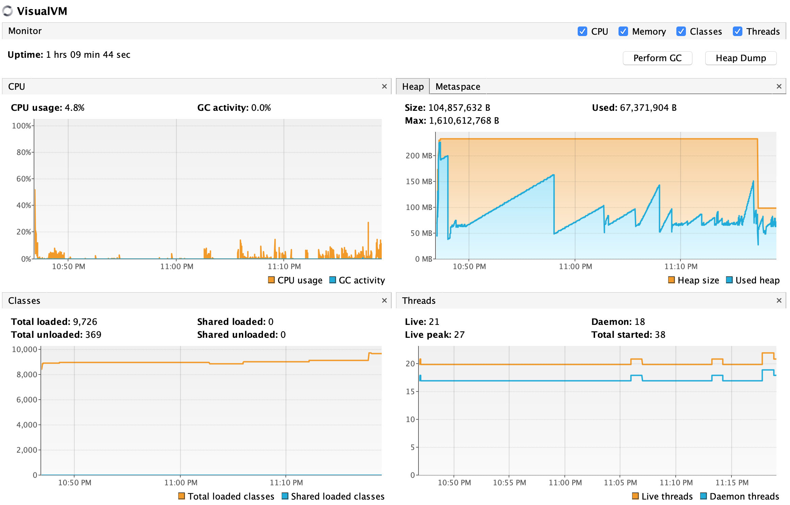
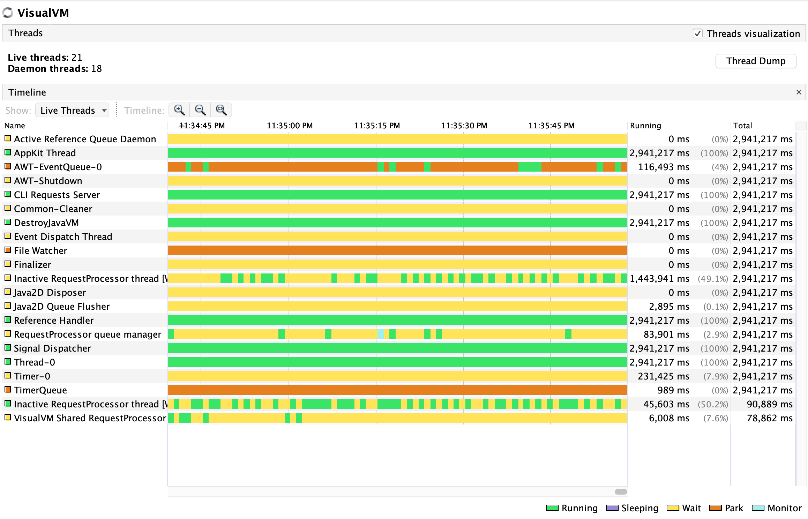
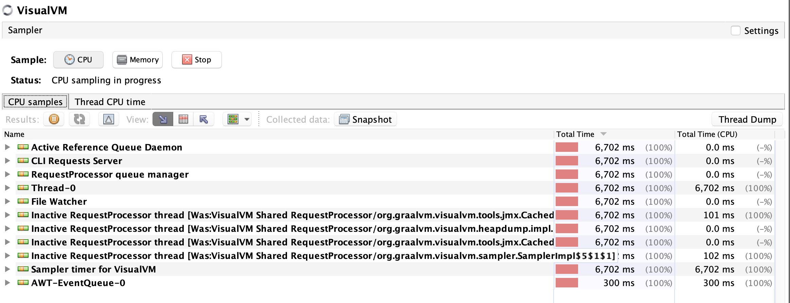

# JavaVisusal 工具

## 1. 什么是 JavaVisusal 工具

JavaVisusal 工具的介绍非常简洁直白，如下：

> VisualVM is a visual tool integrating commandline JDK tools and lightweight profiling capabilities.
>
> Designed for both development and production time use.

可见 JavaVisusal 工具的特性可以总结为：可视化、内置命令行 JDK 工具、轻量、同时适用于开发以及远程部署。

JDK8 中 JavaVisual 工具属于一款自带工具，而在 JDK11 中，JavaVisual 已经不自带，而需要我们从 https://visualvm.github.io/download.html 上自行下载，并进行安装。

## 2. 连接

VisualVM 支持的连接远程节点有 2 种方式：jstatd 和 jmx。其中 jstatd 仅支持 monitor，jmx 才能支持 threads 和 sampler。

推荐使用 JMX 方式，不过，如果检测本地，那么完全不需要配置以及连接，使用 Local 节点即可。

## 3. 界面介绍

VisualVM 一共分为四个页面，如下图所示：

其中 Local 下面显示了本地运行的 Java 应用，例如：

- VisualVM 软件自身就是一个 Java 应用；
- 坚果云也是一个 Java 应用；

我们以 VisualVM 应用为例，依次介绍这 4 个页面的作用。

### 3.1 Overview

对当前应用的概述性信息，如下图所示：

应用有关信息：线程号、主机名称、入口类名称、运行参数

JVM 有关信息：JVM 版本号、$JAVA_HOME 参数、JVM Flags、JVM 参数、系统参数。

### 3.2 Monitor

监视器界面如下图所示：

上图展示的信息有：

- CPU 栏：本机 CPU 使用率，JVM GC 活动频率；
- Heap/Metaspace 栏：这是受到 JVM 管理的内存空间信息，橙色代表总大小，蓝色代表实际使用的大小。肉眼可读的大小至少为 MB，我们可见粗略地去除后六位得到内存大小，例如 VisualVM 软件的最大内存大小为 104MB。
- Classes 栏：类的加载情况（统计单位为个数）；
- Threads 栏：线程的统计分为 Live 以及 Daemon，如果只有 Daemon 线程，那么意味着 JVM 会退出；

### 3.3 Threads

Threads 界面如下图所示：

线程的排序方式是以名称的字母顺序，线程状态包括：

- Running：线程处于正常运行状态；
- Sleeping：线程休眠，通过调用 Thread#sleep 方法会进入此状态；
- Wait：线程等待一个条件的发生，例如通过在 synchrpnized 语句块中调用 Object#wait 方法可以进入此状态；
- Park：线程进入等待状态，例如通过调用 Unsafe#park 方法就会进入此状态。事实上，由于 JUC 下的锁都是基于 Unsafe#park 方法实现，因此只要人为构造一个基于 ReentrantLock 的死锁状况，就能够使线程进入 Park 状态。
- Monitor 状态：线程没有抢占到锁资源时会进入阻塞等待状态，此时线程的状态就是 Monitor 状态。

**注意**：Running 状态下的线程不一定都处于非阻塞状态，例如使用 Java 的 ServerSocket 会有阻塞问题，但是观察 JavaVisual 工具能够发现线程处于 Running 状态。

具体 Demo 可以参考个人项目：[ThreadStateInJava](https://github.com/Spongecaptain/ThreadStateInJava)

### 3.4 Sampler

Sampler 界面用于采样，如下图所示：

可以对 CPU 以及 Memory 进行采样，CPU 专注于对线程的执行时间的采样，Memory 专注于对内存中各种数据类型大小的采样。

### 3.5 其他插件

除了 CPU、线程、堆、类等信息，还可以通过 Toos 安装插件，例如可以通过安装 VisualVM-BufferMonitor 插件来监控堆外内存（包含 DirectByteBuffer 和 MappedByteBuffer）。